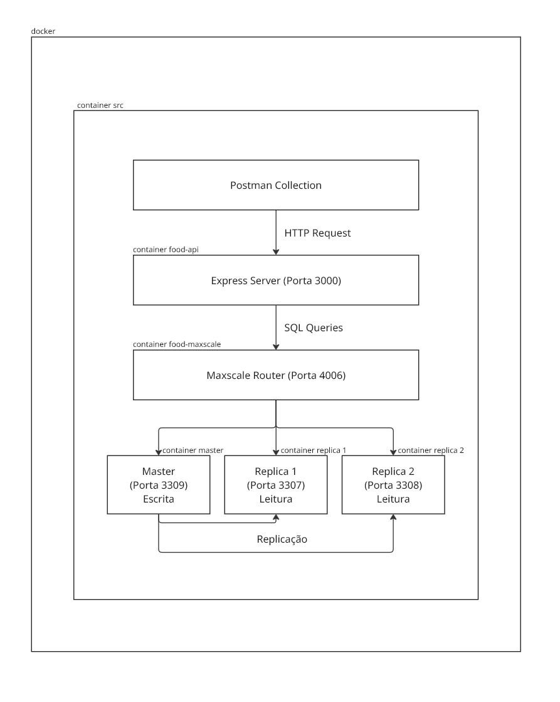
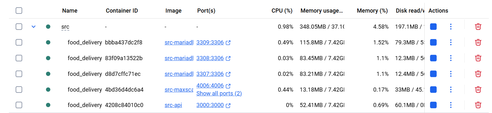
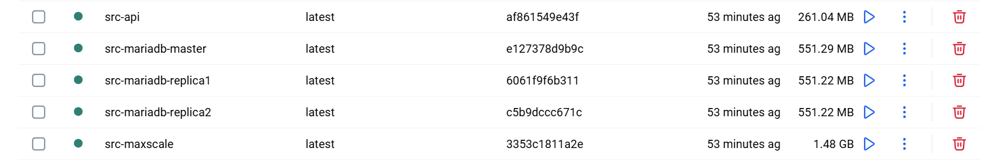

# C3 : Produto

Descrição do desenvolvimento do produto, a sua instalação e execução.

## Desenvolvimento

**Visão Geral do Projeto**

- **DB-master:**  
Servidor principal responsável pelas operações de escrita.

- **DB-réplicas:**  
Servidores secundários configurados como réplicas, para operações de leitura.

- **MaxScale:**  
Proxy e roteador que implementa o read/write splitting, e encaminha automaticamente os pedidos de escrita e leitura para as respetivas bases de dados.

- **API:**  
Serviço Node.js/Express que implementa os endpoints da API e comunica com a base de dados exclusivamente através do MaxScale.


**Arquitetura do Projeto:**

  

- Imagem desenhada no Miro: [Arquitetura](https://miro.com/app/board/uXjVJhjT7X0=/?share_link_id=289133236006)


**Fluxo de Dados:**

  

- Imagem desenhada no Miro: [Fluxo de Dados](https://miro.com/app/board/uXjVJi6sH_8=/?share_link_id=315844749630)  


**Estrutura do Projeto**

- **Docker-compose**

**1. Rede e Volumes**  
Rede: food_network  
Volumes: master_data, replica1_data, replica2_data  

**2. Master**  
Iniciada com os scripts de criação da base de dados e inserção dos dados iniciais.  
Executa scripts na ordem:  
- Cria utilizador para MaxScale (maxscale_user.sh)  
- Cria base de dados e tabelas (schema.sql)/init  
- Insere dados iniciais (seed.sql) 
- Cria triggers de audit (audit.sql)       

Após a inicialização, a base de dados fica acessível na porta 3309.

**3. Réplicas**   
Iniciadas nas portas 3307 e 3308, na BD-replica 1 e na BD-replica2, respetivamente.  
Cada réplica espera Master estar ligado para se conectar e iniciar o processo de replicação até ficarem totalmente sincronizadas.  

**4. Inicialização do MaxScale**  
Lê as configurações definidas no ficheiro maxscale.cnf, que cria o monitor.  
Estabelece ligação às três bases de dados: Master, Replica1 e Replica2.  

**5. MariaDB Monitor**  
Verifica o estado do Master e das Réplicas a cada 2 segundos com pings. - health check  
Promove réplica a Master se Master cair - auto-failover  
Reconecta servidores que voltam online - auto-rejoin  
Router: ReadWriteSplit - read-only enforcement  
- SELECTs são encaminhados para as réplicas.  
- INSERTs / UPDATEs / DELETEs são enviados para o Master.    

Interface - porta 8989  
- Credenciais: admin / mariadb  
- Permite monitorizar o estado do Master e das Réplicas.  

**Serviços Ativos**

- localhost:3000 – Express API  
- localhost:3309 – MariaDB Master  
- localhost:3307 – MariaDB Replica 1  
- localhost:3308 – MariaDB Replica 2  
- localhost:4006 – MaxScale (router)  
- localhost:8989 – MaxScale Dashboard  

**Imagem API (Express Server)**

**src/express-server/Dockerfile**

```dockerfile
FROM node:20-alpine                   # Faz download da imagem base
WORKDIR /app                          # Define o diretório de trabalho
COPY package*.json .                  # Copia o package.json
RUN npm install                       # Instala as dependências
COPY . .                              # Copia o resto do código
EXPOSE 3000                           # Indica a porta usada pelo Express
CMD ["node", "index.js"]              # Inicia o servidor
```  


**Imagem mariadb-master**

**src/mariadb-master/Dockerfile**

```dockerfile
FROM mariadb:11.2                                    # Faz download da imagem base MariaDB
COPY my.cnf /etc/mysql/conf.d/                       # Aplica configurações personalizadas do servidor
COPY scripts/ /docker-entrypoint-initdb.d/           # Copia os scripts de inicialização
```  

**Scripts Executados** (em ordem de execução):  
- `00_maxscale_user.sh` - Cria o utilizador utilizado pelo MaxScale  
- `01_schema.sh` - Aponta para o ficheiro principal de schema  
- `01_schema.sql` - Cria a base de dados e as tabelas  
- `02_seed.sql` - Insere dados iniciais na base de dados  
- `03_audit.sql` - Configura audit e triggers  
- `04_setup_replication.sql` - Cria o utilizador de replicação e ativa a replicação no Master  


**Imagem mariadb-replicas**

**src/mariadb-replica/Dockerfile**

```dockerfile
FROM mariadb:11.2                                      # Faz download da imagem base MariaDB
COPY my.cnf /etc/mysql/conf.d/                         # Aplica configurações personalizadas do servidor
COPY scripts/ /docker-entrypoint-initdb.d/             # Copia os scripts de inicialização

RUN chmod +x /docker-entrypoint-initdb.d/*.sh 2>/dev/null || true  
# Permite que os bash possam ser executados quando o MariaDB estiver pronto
```  

**Scripts Executados:**  
- `01_setup_replication.sh` - Configura a réplica e conecta ao Master para iniciar a replicação  


**Imagem maxscale**

**src/maxscale/Dockerfile**

```dockerfile
FROM mariadb/maxscale:23.08                         # Descarrega a imagem do maxscale
COPY maxscale.cnf.ini /etc/maxscale.cnf             # Copia a configuração do servidor, monitor e routing
```             
  
Assim, o MaxScale liga-se ao mariadb-master, mariadb-replica1, mariadb-replica2. Depois Inicia o MariaDB monitor, ativa o Read/Write Slipt Router e cria o listener da API e o painel de administração.  


**Base de Dados - Estrutura**

*Tabelas Principais*

**Restaurantes:**  
- id (obrigatório, primary key)
- nome (obrigatório)
- morada (obrigatório)
- telefone
- especialidade
- tempo médio de preparação
- taxa de entrega
- (...)

**Pratos:**  
- restaurante_id (obrigatório) - Relação 1:n com restaurantes
- nome (obrigatório)
- preco (obrigatório)
- descrição (opcionais)
- vegetariano (opcionais)
- disponivel (opcionais)
- (...)

**Clientes:**  
- nome (obrigatório)
- email (obrigatório, único)
- telefone (obrigatório)
- (...)

**Entregas:**  
- cliente_id (obrigatório)
- restaurante_id (obrigatório)
- morada_entrega_id (obrigatório)
- estado (opcional: pendente, a_caminho, entregue, cancelada)
- (...)

**Ingredientes:**   
- nome (obrigatório, único)
- unidade (opcional: g, kg, ml, l, unidade, fatia - padrão: g)
- alergeno (opcional; boolean - padrão: false)
- (...)

**Pedidos:**  
- cliente_id (obrigatório)
- restaurante_id (obrigatório)
- morada_entrega_id (obrigatório)
- metodo_pagamento (obrigatório: cartao, mbway, dinheiro, carteira)
- código_pedido (obrigatório)
- estado (opcionais)
- observações (opcionais)

*Tabelas Secundárias*

**pratos_ingredientes:**  
- prato_id (obrigatório)
- ingrediente_id (obrigatório)
- quantidade (obrigatório)
- (...)

**categorias_pratos:**  
- id (obrigatório)
- nome (obrigatório)
- descricao
- (...)

**moradas_entrega:**  
- cliente_id (obrigatório)
- tipo
- morada (obrigatório)
- codpostal
- cidade

**entregadores:**  
- nome
- email
- telefone
- veículo
- matricula
- GPS
- rating

**pedidos_pratos:**  
- quantidade
- preco_unitario
- subtotal_item.

*Extra*  

**audit_log** - os *triggers* preenchem as alterações nas tabelas: restaurantes, pratos, clientes, pedidos, entregas  
  

**Postman**  

*Restaurante:*  
GET /api/restaurantes -> listar todos os restaurantes  
GET /api/restaurantes/{id} -> listar restaurante pelo seu id  
GET /api/restaurantes/{id}/pratos -> listar pratos de um restaurante  
POST /api/restaurantes -> criar restaurante  
PUT /api/restaurantes/{id} -> atualizar informações do restaurante  
DELETE /api/restaurantes/{id} -> apagar restaurante pelo seu id  

*Pratos:*  
GET /api/pratos -> listar todos os pratos  
GET /api/pratos/{id} -> listar prato pelo seu id  
GET /api/pratos/{id}/ingredientes -> listar ingredientes de um prato  
POST /api/pratos -> criar prato  
POST /api/pratos/{id}/ingredientes -> adicionar ingrediente a um prato  
PUT /api/pratos/{id} -> atualizar informações do prato  
DELETE /api/pratos/{id} -> apagar prato pelo seu id  
DELETE /api/pratos/{id}/ingredientes -> remover ingrediente de um prato  

*Clientes:*  
GET /api/clientes -> listar todos os clientes  
GET /api/clientes/{id} -> listar cliente pelo seu id  
POST /api/clientes -> criar cliente  
PUT /api/clientes/{id} -> atualizar informações do cliente  
DELETE /api/clientes/{id} -> apagar cliente pelo seu id 

**Nota:** O DELETE só vai eliminar um cliente que não tenha entregas associadas ao id do mesmo.

*Entregas:*  
GET /api/entregas -> listar todas as entregas  
GET /api/entregas/{id} -> listar determinada entrega  
POST /api/entregas -> criar entrega  
PUT /api/entregas/{id} -> atualizar dados de uma entrega  
DELETE /api/entregas/{id} -> apagar entrega  

*Ingredientes:*  
GET /api/ingredientes -> listar todos os ingredientes  
GET /api/ingredientes/{id} -> listar ingrediente  
POST /api/ingredientes -> criar ingrediente  
PUT /api/ingredientes/{id} -> atualizar informação de determinado ingrediente  
DELETE /api/ingredientes/{id} -> apagar determinado ingrediente  

*Pedidos:*  
GET /api/pedidos -> listar todos os pedidos  
GET /api/pedidos/{id} -> listar determinado pedido  
POST /api/pedidos -> criar pedido  
PUT /api/pedidos/{id} -> atualizar informação de determinado pedido  
DELETE /api/pedidos/{id} -> apagar determinado pedido  

## Instalação

O projeto pode ser executado através do *docker-compose.dev* ou através do *docker-compose.prod*, tendo em conta que, se for executado o *docker-compose.prod*, é necessário ter *login* no DockerHub.  

**Pré-requisitos:**
- Docker e Docker Compose instalados
- Portas 3000, 3307, 3308, 3309, 4006 e 8989 disponíveis
- (Opcional) Conta no DockerHub para usar imagens de produção

**DockerHub:**
O projeto utiliza o reoisitório DockerHub **[inf25dw1g13](https://hub.docker.com/repositories/inf25dw1g13)** com os seguintes repositórios públicos:
- `inf25dw1g13/food-delivery-api:latest` - Imagem da API Express
- `inf25dw1g13/food-delivery-mariadb-master:latest` - Imagem do MariaDB Master
- `inf25dw1g13/food-delivery-mariadb-replica:latest` - Imagem do MariaDB Replica
- `inf25dw1g13/food-delivery-maxscale:latest` - Imagem do MaxScale

**Instruções de instalação:**

1. Navegue até à pasta **src** do projeto:
   ```bash
   cd src
   ```

2. Execute um dos seguintes comandos:

   **Para desenvolvimento (build local):**
   ```bash
   docker compose -f docker-compose.dev.yaml up --build
   ```
   Este comando constrói as imagens localmente a partir dos Dockerfiles.

   **Para produção (usa imagens do DockerHub):**
   ```bash
   docker login
   docker compose -f docker-compose.prod.yaml up
   ```
   Este comando utiliza as imagens pré-construídas do [DockerHub](https://hub.docker.com/repositories/inf25dw1g13), sendo necessário fazer login primeiro.

3. Aguarde até que todos os containers estejam em execução (pode levar alguns minutos na primeira execução).

**Nota:** Para parar os containers, use `Ctrl+C` ou `docker compose -f docker-compose.dev.yaml down` (ou `docker-compose.prod.yaml` conforme o caso).

**Ambiente de Apresentação:**
O trabalho foi desenvolvido para ser executado em ambiente Docker, podendo ser apresentado em qualquer máquina com Docker instalado. As imagens estão disponíveis no DockerHub para facilitar a execução em diferentes ambientes, incluindo máquinas disponibilizadas pela UMAIA.  

## Uso

Após instalação e execução do *compose (dev ou prod)*, a API fica disponível em:  

- [localhost:3000/api-docs](http://localhost:3000/api-docs)  
Neste link, estão disponíveis os endpoints, de cada recurso, para realizar. As respostas são devolvidas em formato JSON.

- [localhost:3000/health](http://localhost:3000/health)  
Também disponível, serve para verificar o estado do servidor.

- [localhost:8989](http://localhost:8989)  
Link para aceder ao MaxScale: Monitorização (apenas replicação)
Credenciais: username: admin / password: mariadb

## Detalhes de implementação - Requisitos Obrigatórios

**Arquitetura de serviços tipo REST:** 

Cada recurso tem endpoints individuais com métodos HTTP específicos e respostas em JSON. Exemplo de implementação:

**Controller (RestaurantesController.js):**
```javascript
class RestaurantesController {
  async getRestaurantes(req, res) {
    try {
      const { especialidade } = req.query;
      const restaurantes = await RestaurantesService.list({ especialidade });
      res.json(restaurantes);
    } catch (error) {
      res.status(500).json({ error: error.message });
    }
  }

  async createRestaurante(req, res) {
    try {
      const result = await RestaurantesService.create(req.body);
      res.status(201).json(result);
    } catch (error) {
      res.status(400).json({ error: error.message });
    }
  }
}
```

**Service (RestaurantesService.js):**
```javascript
class RestaurantesService {
  async list(filters = {}) {
    const { especialidade } = filters;
    let sql = `SELECT * FROM restaurantes WHERE ativo = TRUE`;
    const params = [];
    
    if (especialidade) {
      sql += ' AND especialidade = ?';
      params.push(especialidade);
    }
    
    return await db.query(sql, params);
  }
}
```

**Pedido HTTP - Postman**

  

**Utilização de pelo menos 4 verbos (métodos) do protocolo HTTP - CRUD:** 

Todos os métodos HTTP (GET, POST, PUT, DELETE) foram implementados em cada recurso. Exemplo de implementação:

```javascript
// GET - Listar recursos
async getRestaurantes(req, res) {
  const restaurantes = await RestaurantesService.list();
  res.json(restaurantes);
}

// POST - Criar recurso
async createRestaurante(req, res) {
  const result = await RestaurantesService.create(req.body);
  res.status(201).json(result);
}

// PUT - Atualizar recurso
async updateRestaurante(req, res) {
  const result = await RestaurantesService.update(id, req.body);
  res.json(result);
}

// DELETE - Apagar recurso
async deleteRestaurante(req, res) {
  await RestaurantesService.delete(id);
  res.status(204).send();
}
```

**Interface no Swagger**

   

**Disponibilizar pelo menos 4 recursos diferentes:** 
- este projeto apresenta: Restaurantes, Pratos, Clientes, Ingredientes, Entregas e Pedidos.  

   

**Utilização de pelo menos uma relação de cardinalidade 1:n entre dois dos recursos:**

O projeto implementa várias relações 1:n. Exemplo de código:

**Relação Restaurantes -> Pratos (RestaurantesService.js):**
```javascript
async getPratos(restauranteId) {
  // Verificar se o restaurante existe
  const restaurante = await this.getById(restauranteId);
  if (!restaurante) {
    throw new Error('Restaurante não encontrado');
  }
  
  // Query para obter os pratos de um restaurante
  const sql = `
    SELECT p.*
    FROM pratos p
    WHERE p.restaurante_id = ? AND p.disponivel = TRUE
    ORDER BY p.created_at DESC, p.updated_at DESC, p.nome ASC
  `;
  
  return await db.query(sql, [restauranteId]);
}
```

**Relações implementadas:**
- `restaurantes -> pratos`: Um restaurante tem muitos pratos
- `restaurantes -> pedidos`: Um restaurante recebe muitos pedidos
- `restaurantes -> entregas`: Um restaurante faz muitas entregas
- `pratos -> pedidos`: Um prato pode estar em muitos pedidos (via tabela intermediária)
- `clientes -> pedidos`: Um cliente pode ter muitos pedidos

**Disponibilização das representações de estado dos recursos em JSON:**  

Todos os recursos retornam dados em formato JSON. Exemplo de resposta:

```json
{
  "id": 38,
  "nome": "Asian Fusion",
  "morada": "Rua de São Pedro, 258",
  "telefone": "289333333",
  "especialidade": "Asiática",
  "tempo_medio_preparacao": 30,
  "taxa_entrega": "2.00",
  "pedido_minimo": "10.00",
  "ativo": 1
}
```

A implementação garante que todas as respostas são em JSON através do middleware `express.json()`:

```javascript
this.app.use(express.json());
this.app.use(express.urlencoded({ extended: true }));
```

  

**Documentar a API com recurso ao formato OpenAPI 3.0:** 

A API foi desenvolvida seguindo uma abordagem **Design-first**, onde a especificação OpenAPI 3.0 foi criada antes da implementação do código. Esta abordagem permite:
- Definição clara dos contratos da API
- Validação automática de requisições e respostas
- Geração automática de documentação interativa (Swagger UI)
- Melhor comunicação entre equipas frontend e backend

**Implementação:**
- Foi utilizado um ficheiro openapi.yaml para documentar a API
- O ficheiro está localizado em: [src/express-server/api/openapi.yaml](../src/express-server/api/openapi.yaml)
- A documentação interativa está disponível em: [http://localhost:3000/api-docs](http://localhost:3000/api-docs)
- A validação de requisições é feita automaticamente através do middleware `express-openapi-validator`

**Disponibilizar uma *Collection* para o Postman para consulta dos recursos:** 
- Foi criada e disponibilizada uma *Postman Collection* para consultar os recursos:
- O ficheiro está localizado em: [src/postman_collection.json](../src/postman_collection.json)
- Pode ser importado diretamente no Postman para testar todos os endpoints da API

**Utilização do MySQL como SGBD:** 
- foi utilizado o MariaDB versão 11.2 como base de dados, com autorização prévia do docente
- A configuração do MariaDB Master está em: [src/mariadb-master](../src/mariadb-master/)
- A configuração das réplicas está em: [src/mariadb-replica](../src/mariadb-replica/)
- Mais informações sobre MariaDB: [https://mariadb.org/](https://mariadb.org/)

**Utilização do Node.js como servidor aplicacional para implementação da camada de serviços:** 

A API foi desenvolvida com Node.js versão 20 e Express server, utilizando arquitetura MVC (Model-View-Controller) com controllers, services e utils.

**Estrutura do Servidor (expressServer.js):**
```javascript
const express = require('express');
const cors = require('cors');
const YAML = require('yamljs');
const swaggerUi = require('swagger-ui-express');

class ExpressServer {
  constructor(port, openApiYaml) {
    this.port = port;
    this.app = express();
    this.openApiPath = openApiYaml;
    this.schema = YAML.load(openApiYaml);
    this.setupMiddleware();
  }

  setupMiddleware() {
    this.app.use(cors());
    this.app.use(express.json());
    this.app.use(express.urlencoded({ extended: true }));
    
    // Swagger UI
    this.app.use('/api-docs', swaggerUi.serve, 
      swaggerUi.setup(this.schema));
    
    // Health check
    this.app.get('/health', (req, res) => {
      res.status(200).json({ status: 'OK' });
    });
  }
}
```

**Conexão à Base de Dados (utils/db.js):**
```javascript
const mysql = require('mysql2/promise');

const pool = mysql.createPool({
  host: process.env.DB_HOST || 'maxscale',
  port: process.env.DB_PORT || 4006,
  user: process.env.DB_USER || 'api_user',
  password: process.env.DB_PASSWORD || 'api_password',
  database: process.env.DB_NAME || 'food_delivery',
  waitForConnections: true,
  connectionLimit: 10
});

async function query(sql, params = []) {
  const [results] = await pool.execute(sql, params);
  return results;
}
```

**Arquitetura:**
- **Controllers** (`controllers/`) - Recebem requisições HTTP e chamam os services
- **Services** (`services/`) - Contêm a lógica de negócio e queries SQL
- **Utils** (`utils/`) - Funções auxiliares (db.js, openapiRouter.js)

O código do servidor está em: [src/express-server](../src/express-server/)  
Mais informações: [Node.js](https://nodejs.org/) | [Express](https://expressjs.com/)

**Disponibilização de configuração para a aplicação multi-container (pelo menos 2 imagens) MySQL + NodeJS:** 
- foram utilizadas 5 imagens para os containers, sendo uma para a API, outra para MariaDB master(principal), outras duas para as réplicas da MariaDB master e uma para o Maxscale (que conecta a base de dados da MariaDB para a API).

  

  

**Requisitos Extra**

**Filtros através de parâmetros HTTP:**  

A API suporta filtros através de query parameters. A implementação é feita nos controllers e services:

**Exemplo - Controller (RestaurantesController.js):**
```javascript
async getRestaurantes(req, res) {
  try {
    const { especialidade } = req.query;
    const restaurantes = await this.list({ especialidade });
    res.json(restaurantes);
  } catch (error) {
    res.status(500).json({ error: error.message });
  }
}
```

**Exemplo - Service (RestaurantesService.js):**
```javascript
async list(filters = {}) {
  const { especialidade } = filters;
  
  let sql = `
    SELECT id, nome, morada, telefone, especialidade, 
           tempo_medio_preparacao, taxa_entrega, pedido_minimo, ativo
    FROM restaurantes 
    WHERE ativo = TRUE
  `;
  
  const params = [];
  
  if (especialidade) {
    sql += ' AND especialidade = ?';
    params.push(especialidade);
  }
  
  sql += ' ORDER BY created_at DESC, updated_at DESC, nome ASC LIMIT 100';
  
  return await db.query(sql, params);
}
```

**Filtros disponíveis:**
- `GET /api/restaurantes?especialidade=Italiana` - Filtrar por especialidade
- `GET /api/pratos?restaurante_id=1` - Filtrar pratos por restaurante
- `GET /api/pratos?vegetariano=true` - Filtrar pratos vegetarianos
- `GET /api/pedidos?estado=pendente` - Filtrar pedidos por estado
- `GET /api/ingredientes?alergeno=true` - Filtrar ingredientes alergénios
   
**Utilização de relação de cardinalidade m:n entre dois dos recursos:**

A API implementa relações muitos-para-muitos através de tabelas intermediárias:

**Relação pratos <-> ingredientes:**

A relação é implementada através da tabela `pratos_ingredientes`. Exemplo de código:

```javascript
// Obter ingredientes de um prato (PratosService.js)
async getIngredientes(pratoId) {
  const sql = `
    SELECT i.id, i.nome, i.unidade, pi.quantidade, pi.obrigatorio
    FROM ingredientes i
    INNER JOIN pratos_ingredientes pi ON i.id = pi.ingrediente_id
    WHERE pi.prato_id = ?
    ORDER BY i.nome
  `;
  return await db.query(sql, [pratoId]);
}

// Adicionar ingrediente a um prato
async addIngrediente(pratoId, ingredienteId, quantidade) {
  const sql = `
    INSERT INTO pratos_ingredientes (prato_id, ingrediente_id, quantidade)
    VALUES (?, ?, ?)
  `;
  await db.query(sql, [pratoId, ingredienteId, quantidade]);
  return { success: true, message: 'Ingrediente adicionado ao prato' };
}
```

**Relação pedidos <-> pratos:**

A relação é implementada através da tabela `pedidos_pratos`. Exemplo de código:

```javascript
// Obter pratos de um pedido (PedidosService.js)
async getPratosPedido(pedidoId) {
  const sql = `
    SELECT pp.*, p.nome as prato_nome, p.preco as preco_base
    FROM pedidos_pratos pp
    INNER JOIN pratos p ON pp.prato_id = p.id
    WHERE pp.pedido_id = ?
  `;
  return await db.query(sql, [pedidoId]);
}
```

**Endpoints disponíveis:**
- `GET /api/pratos/{id}/ingredientes` - Listar ingredientes de um prato
- `POST /api/pratos/{id}/ingredientes` - Adicionar ingrediente a um prato
- `DELETE /api/pratos/{id}/ingredientes?ingrediente_id={id}` - Remover ingrediente de um prato

---
[< Previous](c2.md) | [^ Main](../../../) | [Next >](c4.md)
:--- | :---: | ---: 
